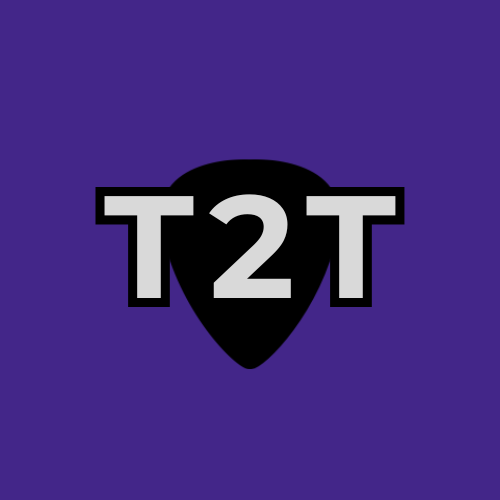

#   Track2Tabs 

Track2Tabs is a web-based guitar learning tool that analyzes audio files and automatically detects chord progressions.  

Upload a song, play it back, and see the current chord, guitar finger placement, and a full chord timeline in real time.

 Live Website:
 [Track2Tabs](https://track-to-tab-proto3.vercel.app/)

## Description

Track2Tabs is a browser based audio analysis system designed to help guitar players learn songs more efficiently. Instead of switching between chord websites, videos, and diagrams, Track2Tabs brings everything into a single interactive experience.

Users upload an MP3 or WAV file, and the system analyzes the audio to determine which guitar chords are being played and when. As the song plays, the interface displays the current chord, shows a guitar chord diagram for finger placement, and updates live in sync with the music. A complete chord timeline with timestamps is also generated for structured practice.

This project focuses on real world usability for learning guitar, allowing users to listen, rewind, and practice chord transitions without breaking focus.

## Usage Instructions

1. Open the Track2Tabs website
2. Drag and drop an MP3 or WAV file (or click to select)
3. Wait for analysis to complete
4. Press play on the audio player
5. Follow along as:
   - The current chord updates live
   - The chord diagram shows finger placement
   - The chord timeline displays timestamps
6. Rewind or scrub to practice difficult transitions
7. Download the chord sheet for offline reference

## Supported Chords

Track2Tabs currently supports the following chords:

- A, Am  
- Bm  
- C, C7  
- D, Dm, D7  
- E, Em  
- F  
- G, G7  

## Developer Notes

The frontend is hosted on Vercel and built with HTML, CSS, and JavaScript, handling audio playback, real time chord syncing, and UI rendering. A Python backend hosted on Railway performs audio processing and chord detection. Guitar chord diagrams are served as static assets via GitHub Pages for reliability. The user experience runs entirely in the browser, with analysis handled on the server side.

[Inspiration](https://github.com/roopaksai543/trackToTab-Proto3/tree/main/inspiration)  
[Project Status](https://github.com/roopaksai543/trackToTab-Proto3/tree/main/projectStatus)

Built by **Roopaksai Sivakumar**  
Computer Engineering @ UC Irvine  
